# Titre1
## Titre2
### Titre3
#### Titre4
##### Titre5
###### Titre6

**Ecriture *grasse* Gras***  `Je desire faire encore un autre test`  __Test__

~~Les écrite barré~~

==Je usi sle test==  `Je suis le test` 
- [ ] Te suis est test
- [ ] La mangue
- [ ] Safou

[Aller sur ma chaîne Youtube](https://youtube.com/@atte-thm)

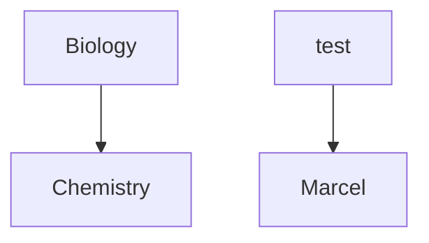

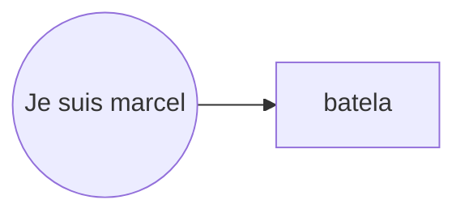

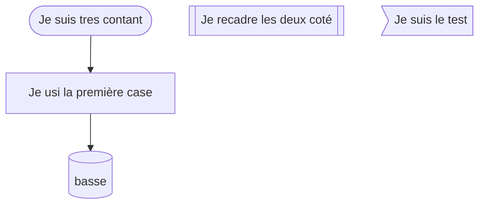

# Je suis un peu independant

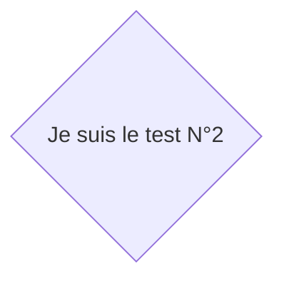
# Le suisvant

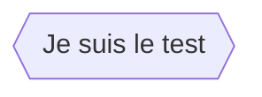

# Les relaions

~~~mermaid
flowchart LR

A-->|Je suis lien|B
~~~~
~~~mermaid 
flowchart LR
	LettreA---|Liens|LettreB
~~~

# Lien vace les pointillés

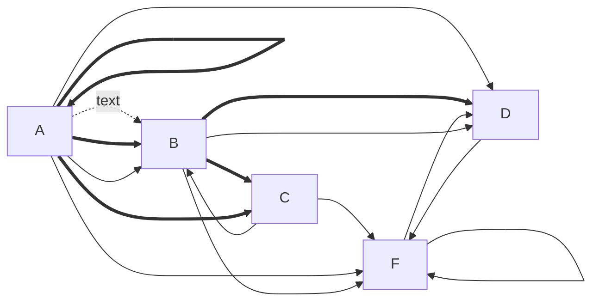

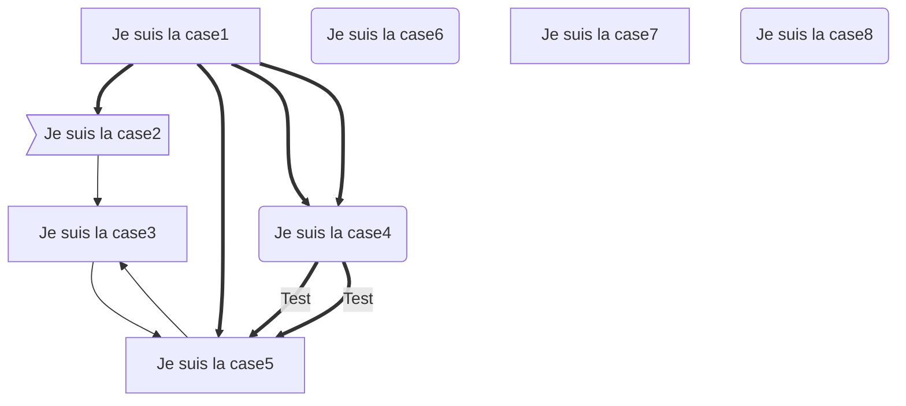

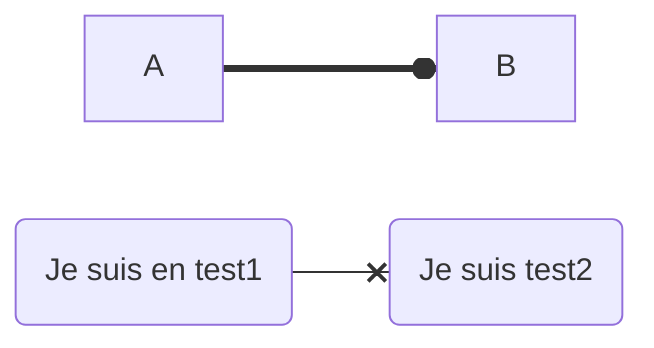

# Test cool

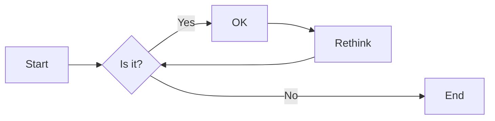

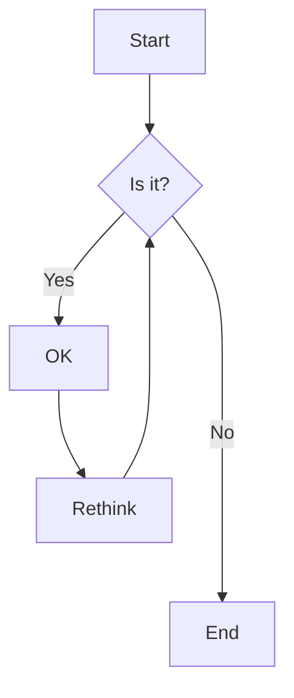
## Autre methode

# Les blocks

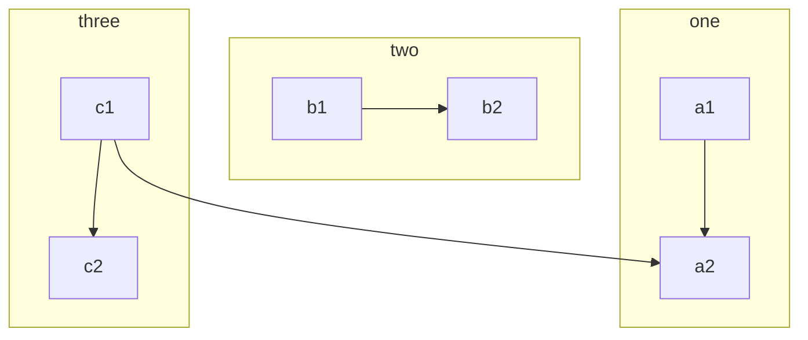

# Nommer les blocks

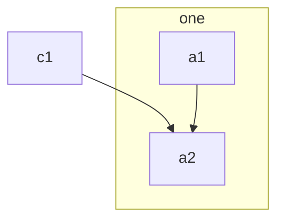

# Le Trios

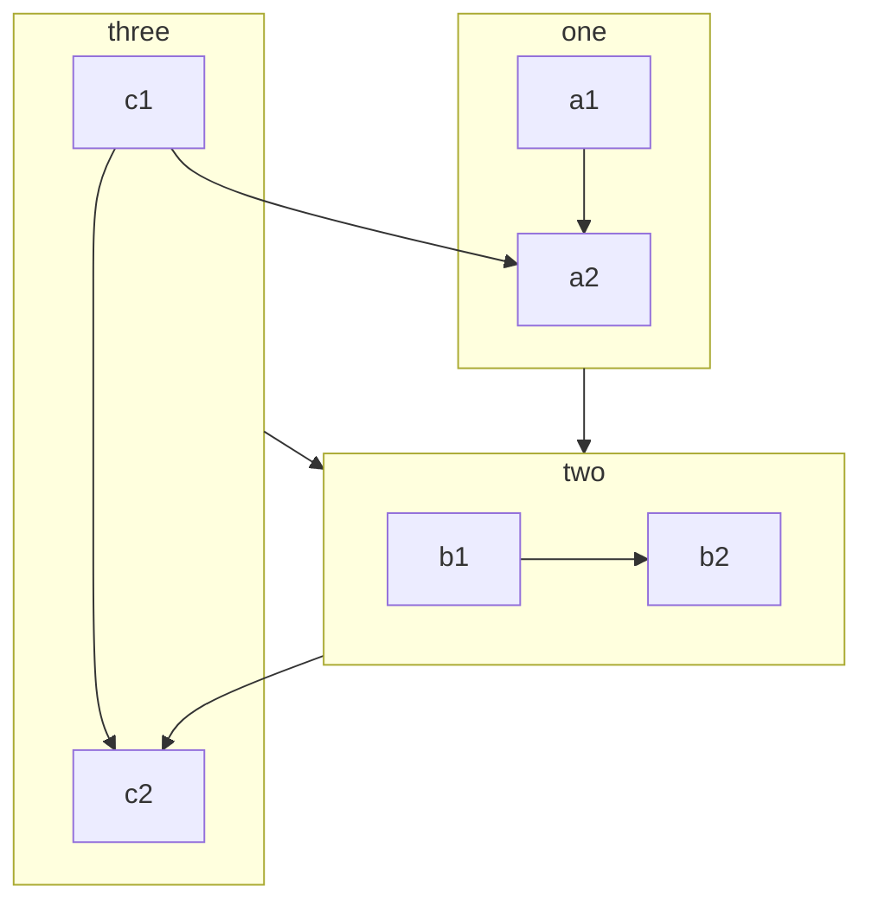

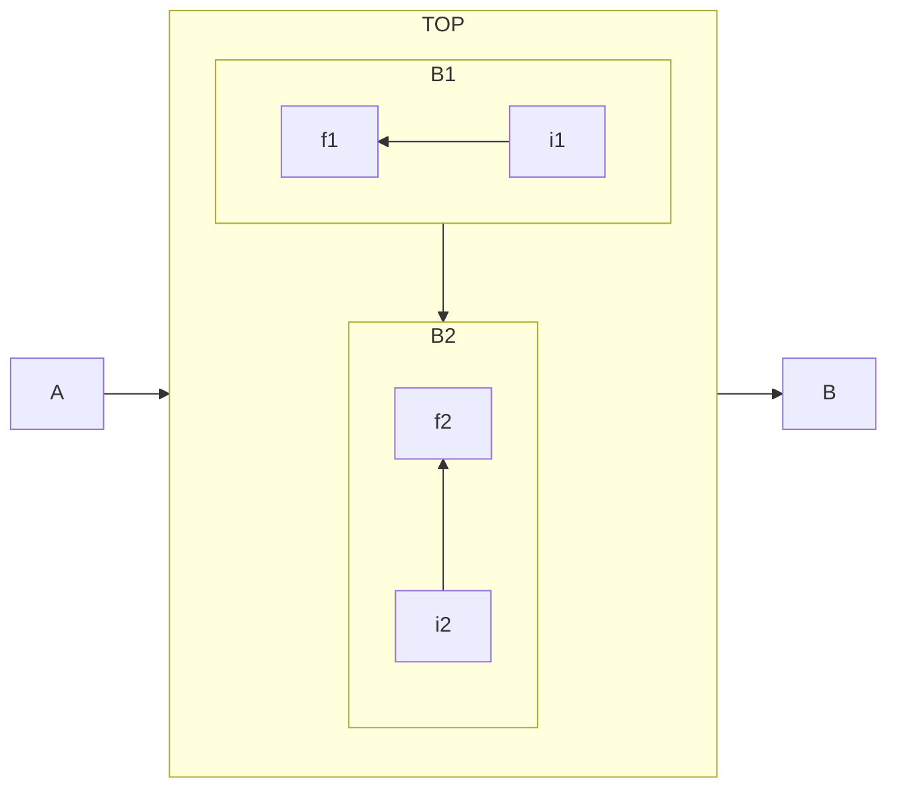

# Correction des limites

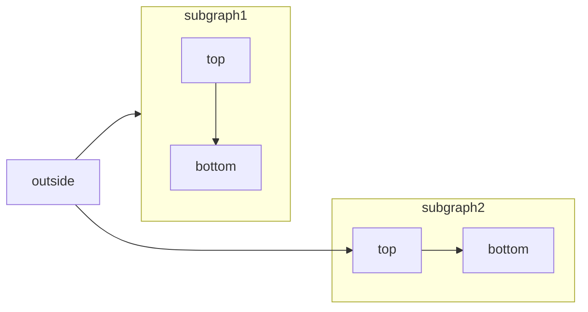

# Mon propres test

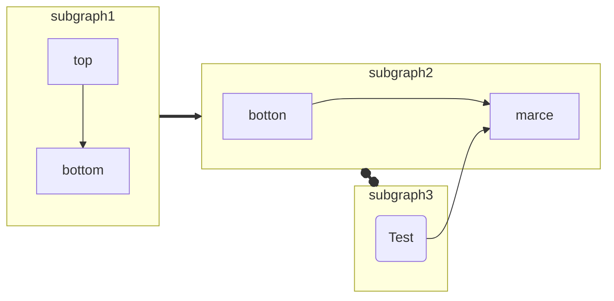
